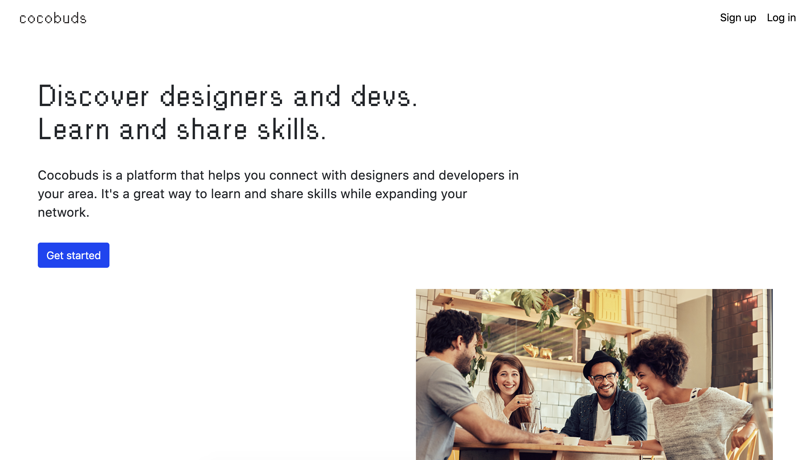

  

    

      

      

      

    

    
  

  

    

      

      

      

    

    
  

  

    

    

    
    

    

  

  

    

    

    
    

    

  

  

    

    

    
    

    

  

  

    
    

    

  

  

    
    

    

  

