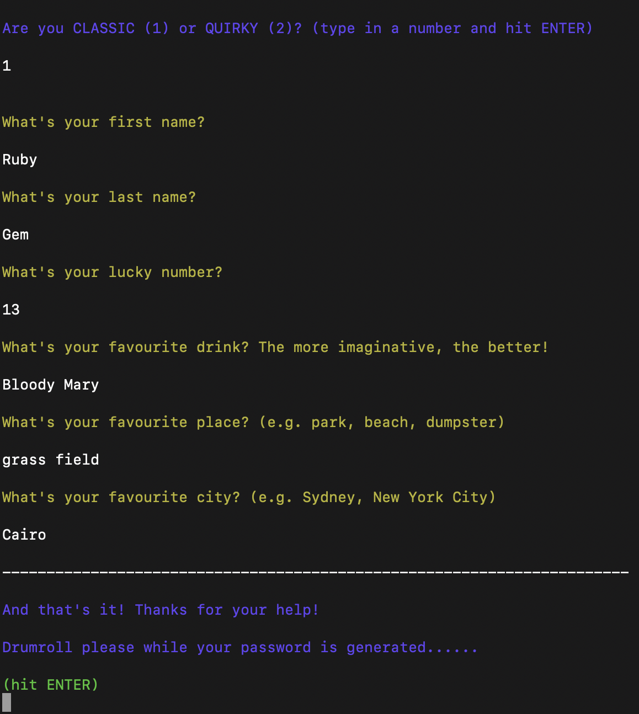
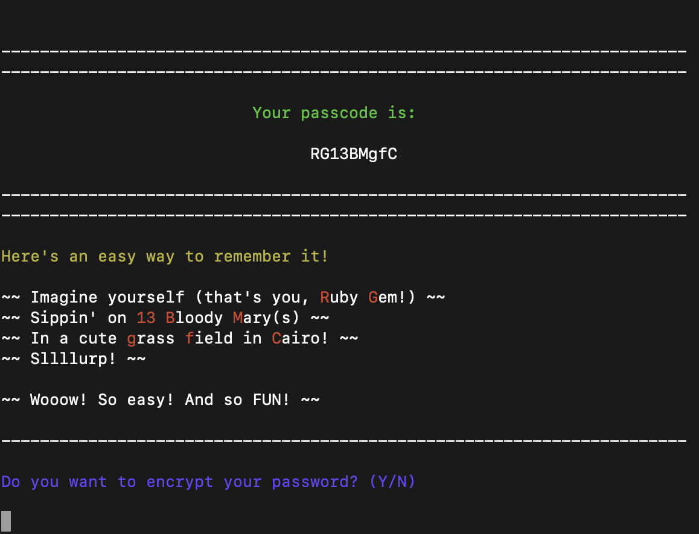
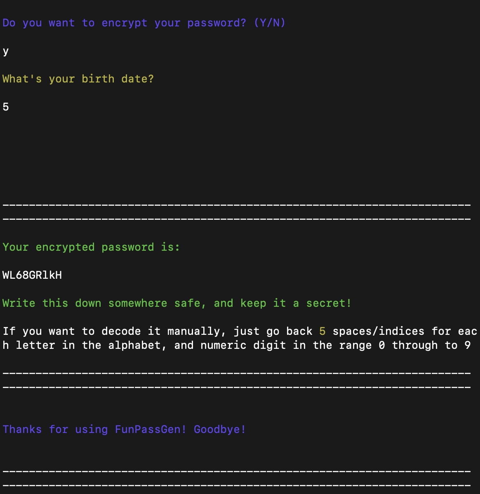

  

    

      

      

      

    

    
  

  

    

      

      

      

    

    
  

  

    

      

      

      

    

    
  

  

    

      

      

      

    

    
  

